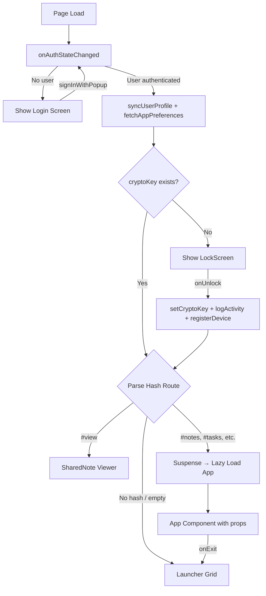
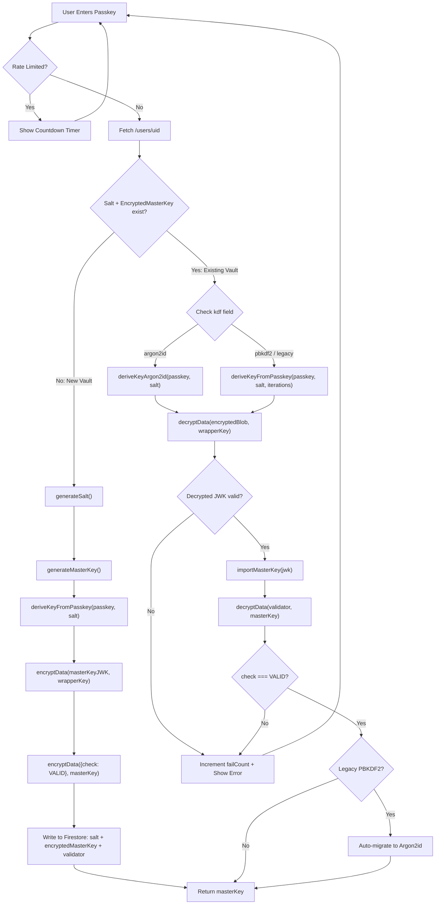
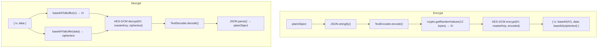
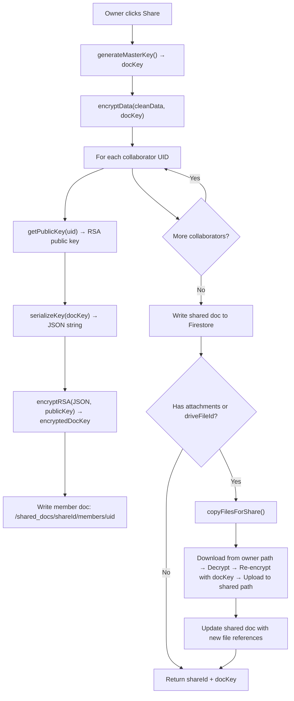
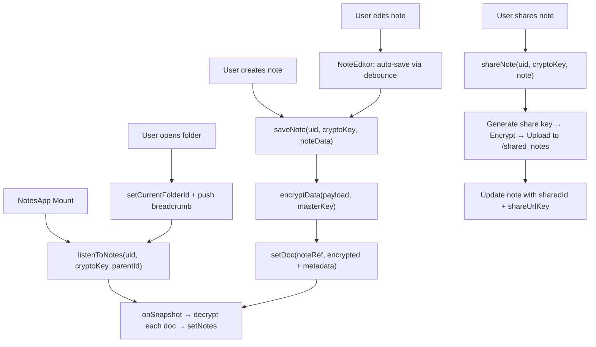
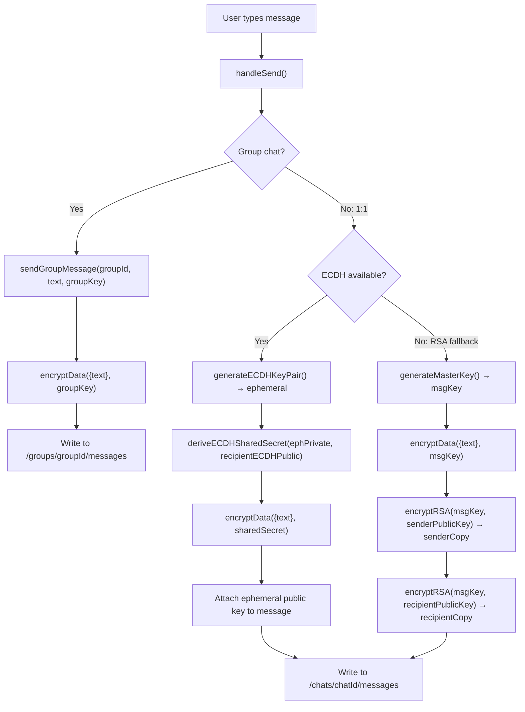

# Control Flow Graphs — Sanctum v2.0

All diagrams use Mermaid syntax and depict the major control-flow paths through the application.

---

## 1. Application Bootstrap (`App.jsx`)



---

## 2. Vault Unlock / Initialization (`vault.js + LockScreen.jsx`)



---

## 3. Data Encrypt / Decrypt (`crypto.js`)



---

## 4. Share Document Flow (`collaboration.js`)



---

## 5. Auto-Lock Flow (`App.jsx`)

```mermaid
flowchart TD
    A[cryptoKey set] --> B["Read sanctum_autolock from localStorage"]
    B --> C{Timeout = 0 (Never)?}
    C -->|Yes| D[No timer set]
    C -->|No| E["setTimeout(lock, timeout)"]
    E --> F{User interaction?}
    F -->|mousedown/keydown/touchstart/scroll| G[Clear + Reset timer]
    G --> E
    F -->|Timeout fires| H["setCryptoKey(null) → Lock"]

    A --> I{lock_on_hidden enabled?}
    I -->|Yes| J[Listen visibilitychange]
    J --> K{Tab hidden?}
    K -->|Yes| H
    K -->|No| J
```

---

## 6. Notes App CRUD Flow (`Notes.jsx`)



---

## 7. SecureShare Message Flow (`SecureShare.jsx`)


