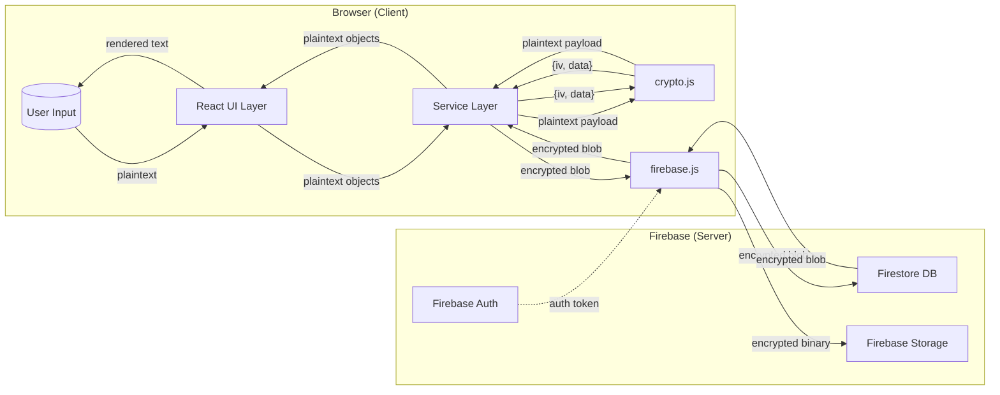
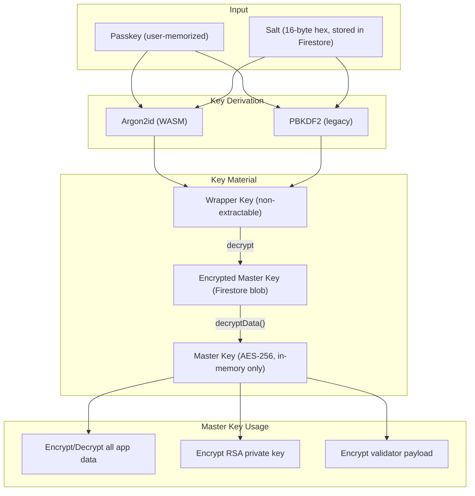
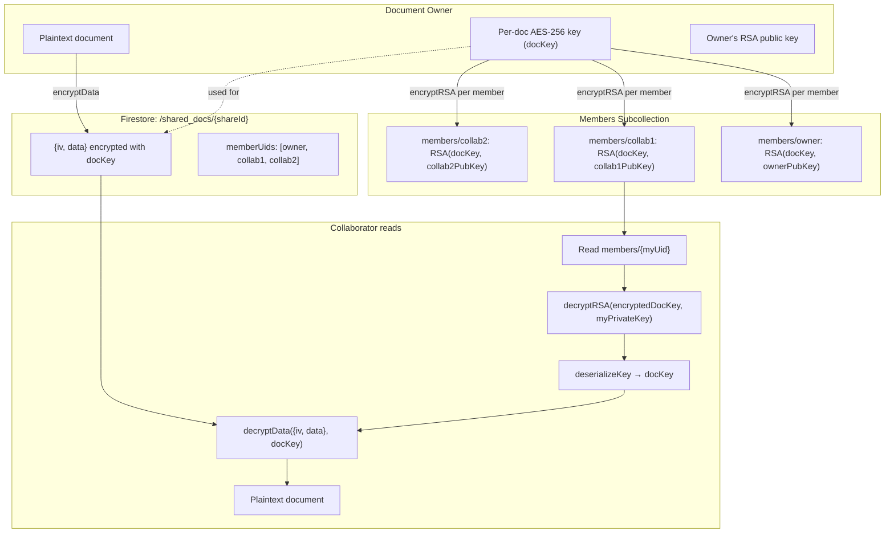
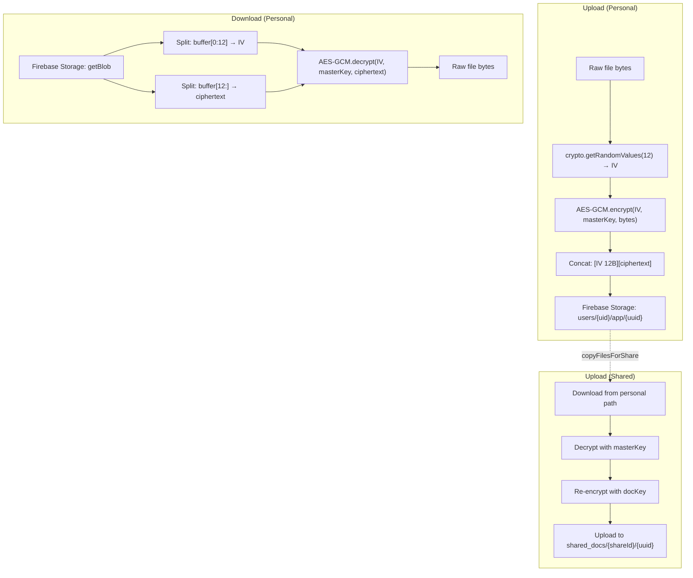
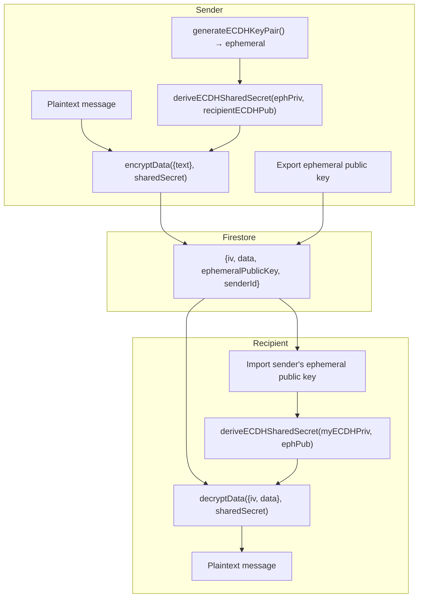
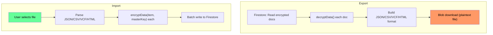

# Data Flow Diagrams — Sanctum v2.0

Data flow diagrams showing how sensitive data moves through the system.

---

## 1. High-Level Data Flow

---

## 2. Key Derivation Data Flow

---

## 3. Per-App Data Flow Pattern

```mermaid
flowchart TD
    subgraph Write["Write Path"]
        W1["User edits item"] --> W2["Component handler"]
        W2 --> W3["Service: buildPayload()"]
        W3 --> W4["encryptData(payload, masterKey)"]
        W4 --> W5["Firestore: setDoc(ref, {iv, data, ...meta})"]
    end

    subgraph Read["Read Path"]
        R1["Firestore: onSnapshot"] --> R2["Raw doc {iv, data, ...meta}"]
        R2 --> R3["decryptData(doc, masterKey)"]
        R3 --> R4["Merge decrypted + metadata"]
        R4 --> R5["setState(items)"]
        R5 --> R6["React re-render"]
    end
```

---

## 4. Collaboration Key Distribution

---

## 5. File Storage Data Flow

---

## 6. SecureShare E2E Message Data Flow

---

## 7. Import/Export Data Flow

> ⚠️ Exported files contain **plaintext sensitive data**. The file never touches the server but exists unencrypted on the user's device.
