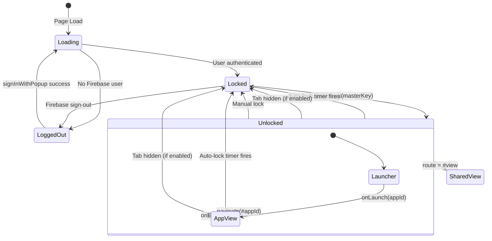
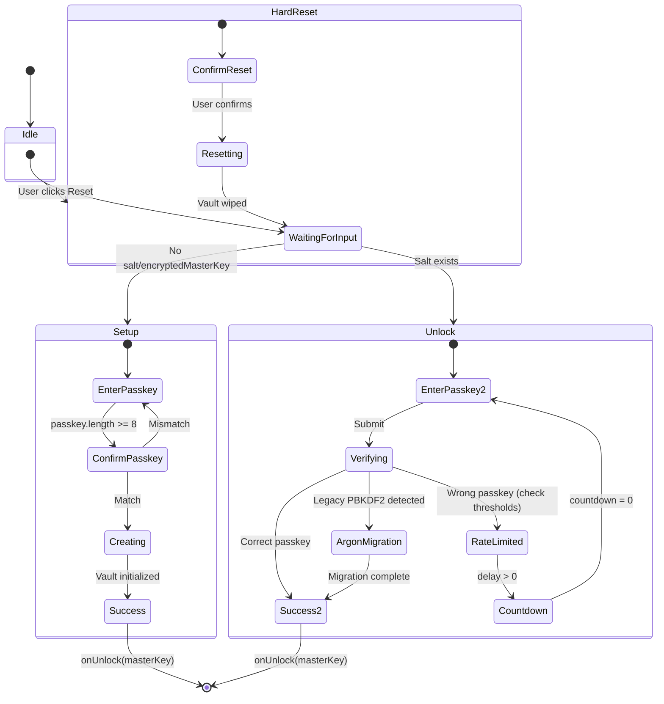
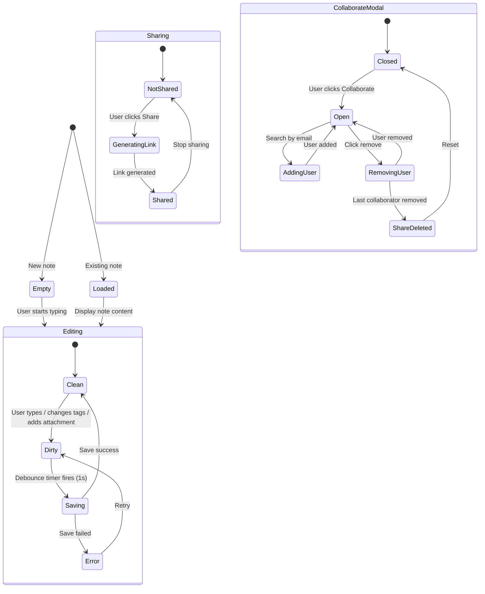
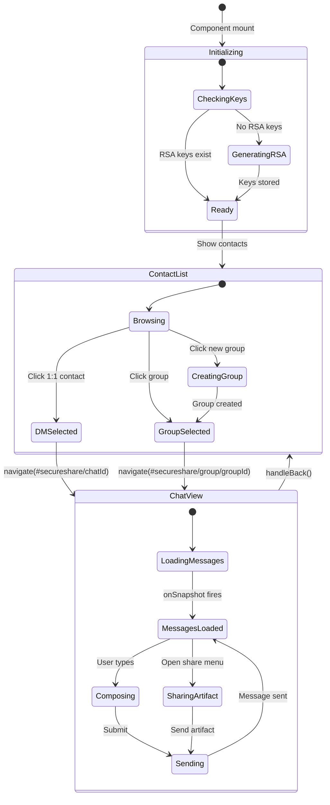
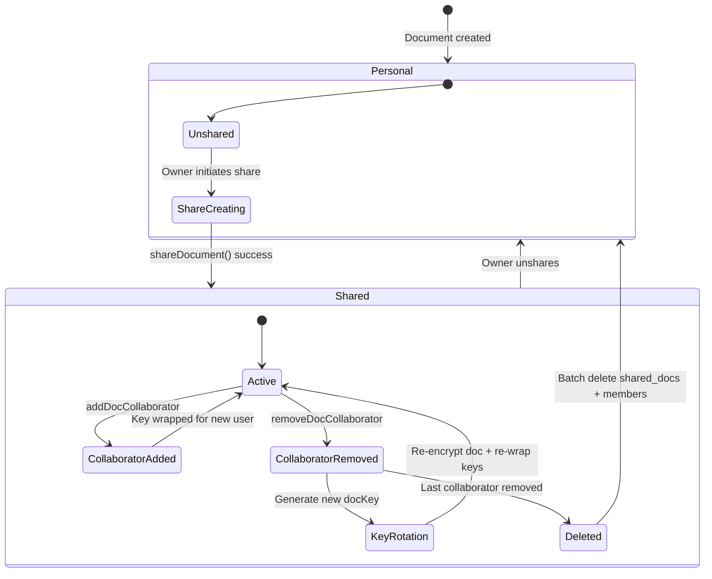
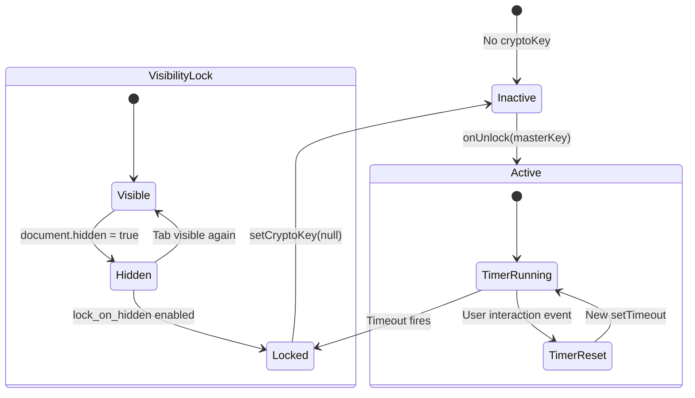
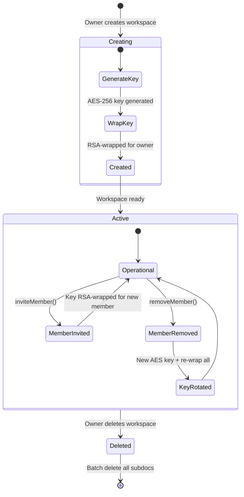

# Finite State Machines — Sanctum v2.0

State transition diagrams for all stateful systems in the application.

---

## 1. Application Shell FSM (`App.jsx`)

---

## 2. Lock Screen FSM (`LockScreen.jsx`)

---

## 3. Note Editor FSM (`NoteEditor.jsx`)

---

## 4. SecureShare Chat FSM

---

## 5. Collaboration Document Lifecycle

---

## 6. Auto-Lock Timer FSM

---

## 7. Workspace Lifecycle FSM

