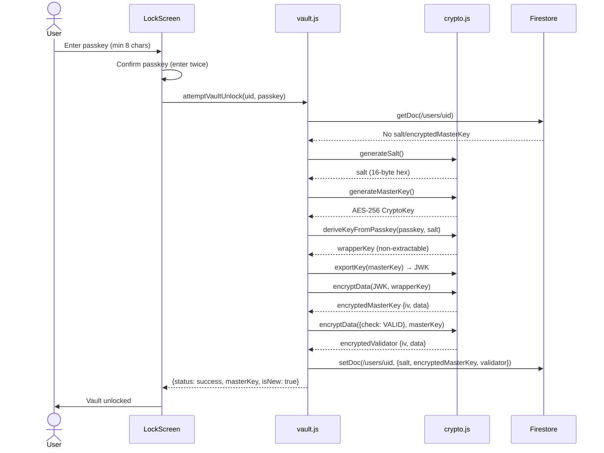
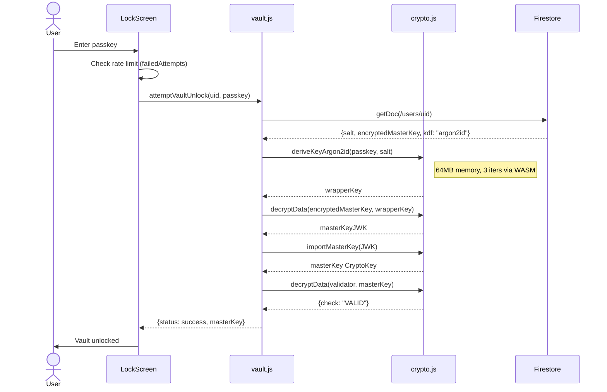
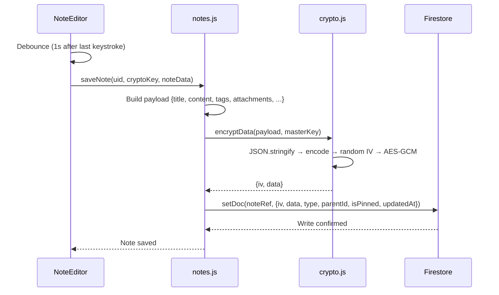
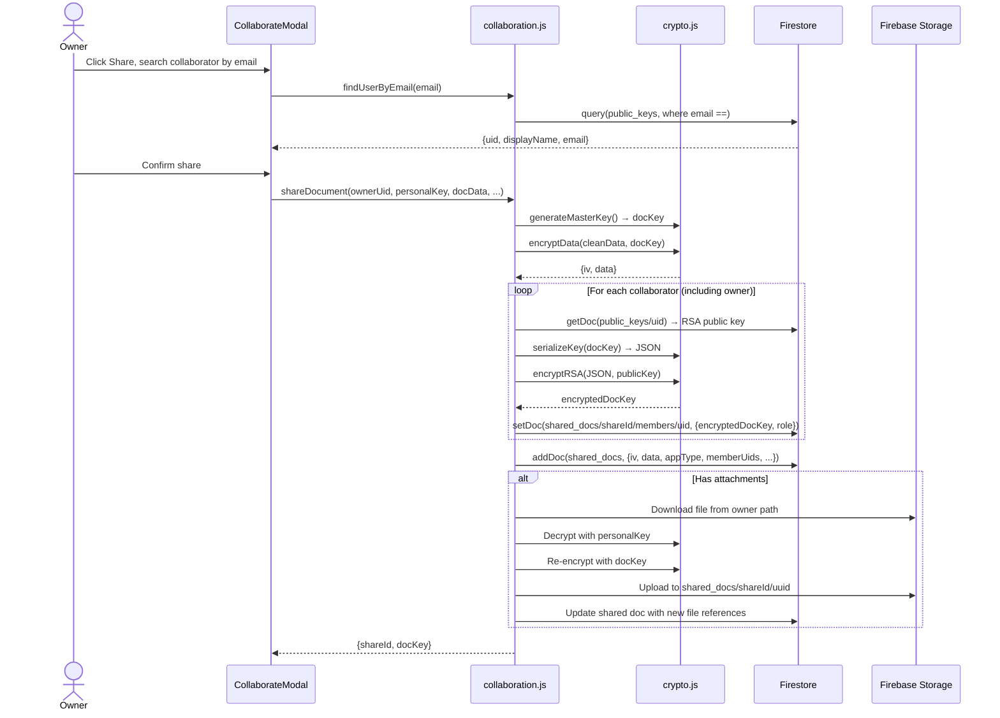
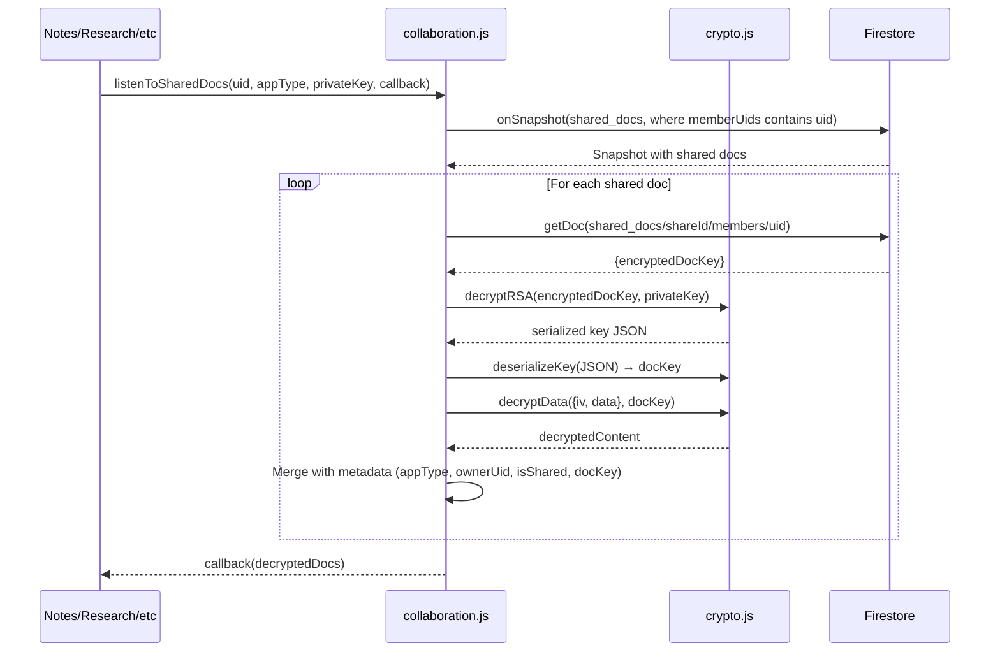
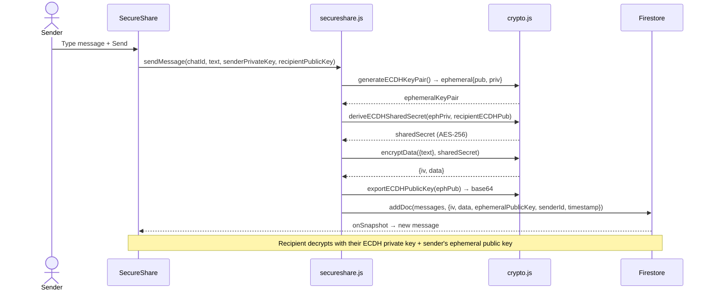
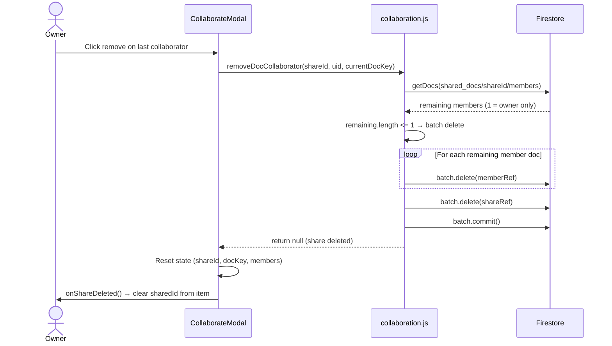
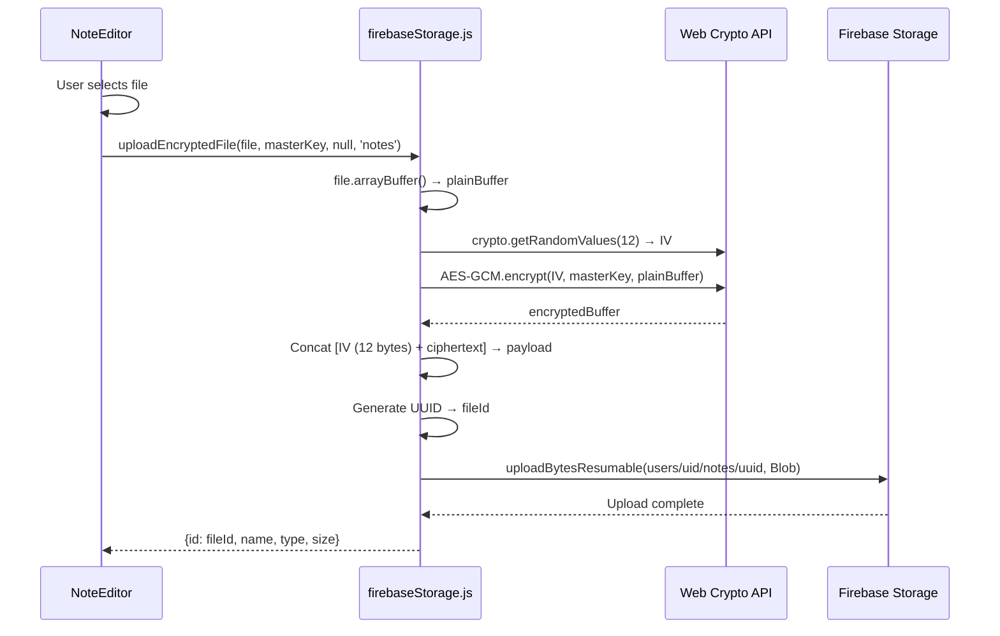

# Sequence Diagrams — Sanctum v2.0

Interaction timelines between components, services, and Firebase.

---

## 1. First-Time User Setup

---

## 2. Returning User Unlock (Argon2id)

---

## 3. Save Encrypted Note

---

## 4. Share Document with Collaborator

---

## 5. Collaborator Opens Shared Document

---

## 6. SecureShare 1:1 Message (ECDH Forward Secrecy)

---

## 7. Remove Last Collaborator → Delete Share

---

## 8. File Upload with Encryption

